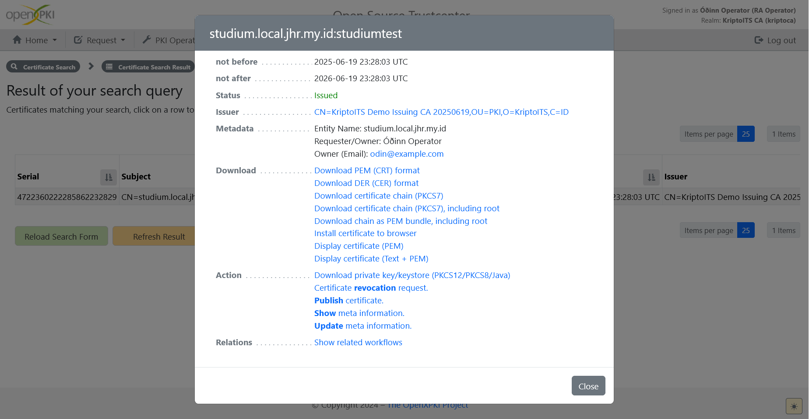
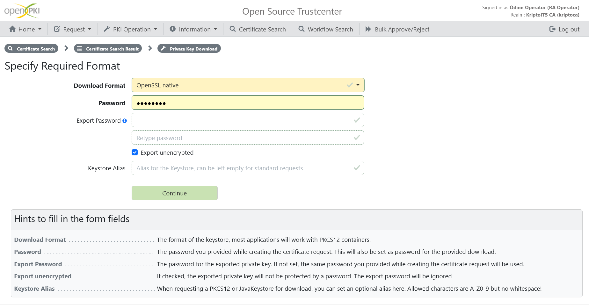
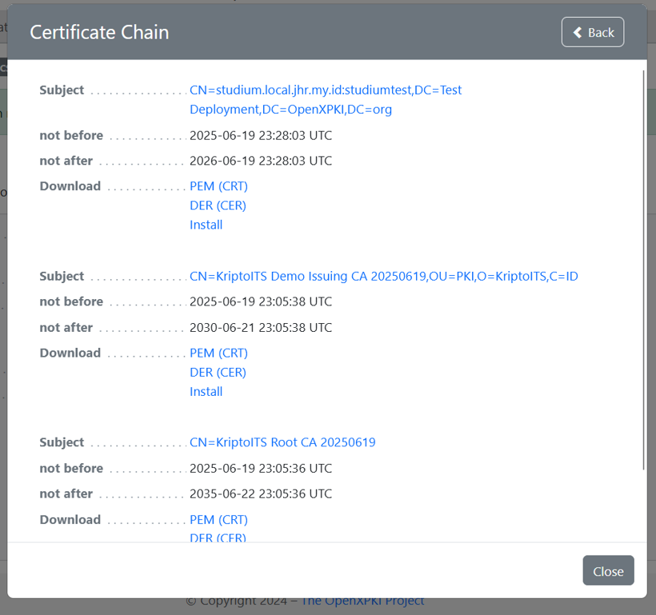
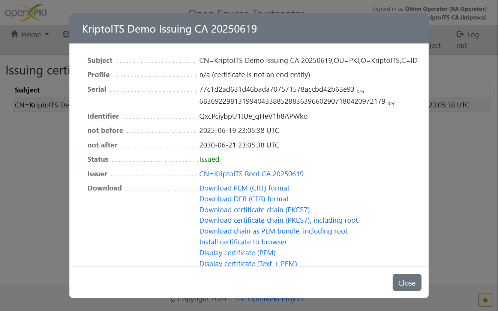
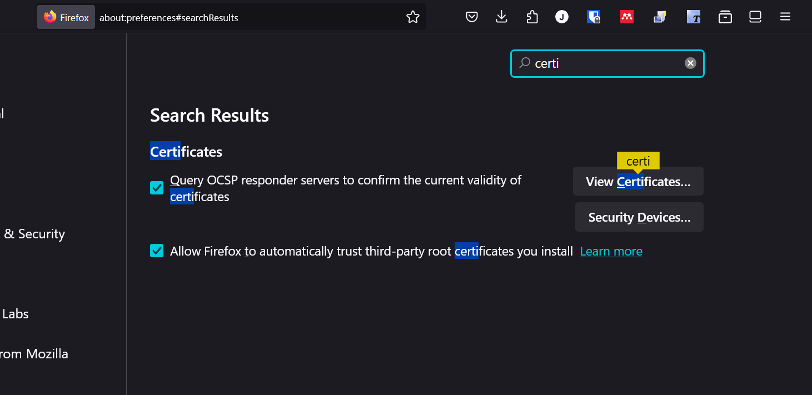
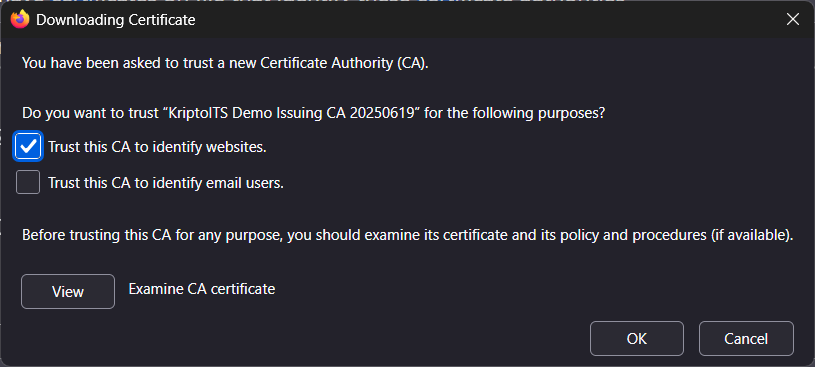
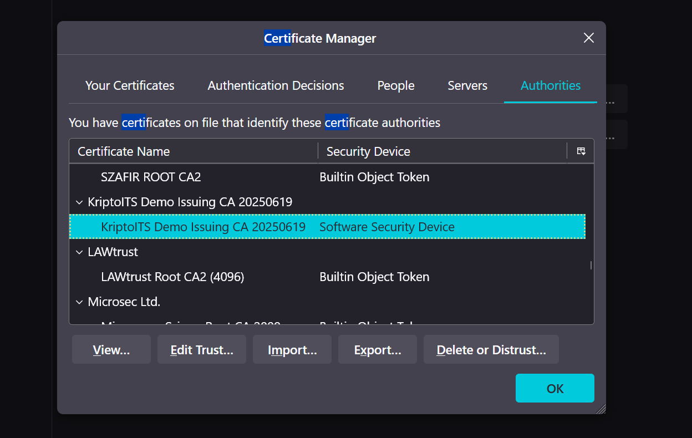

# Cryptography Final Project

## OpenXPKI

### What is OpenXPKI?

OpenXPKI (Open eXtensible Public Key Infrastructure) is an open-source framework designed to build and manage Public Key Infrastructure (PKI) in a secure and flexible manner. It provides comprehensive features for managing digital certificates—from issuance to revocation—to support secure communication over the internet.

### Key Roles & Features of OpenXPKI

- Digital Certificate Management
OpenXPKI supports the full lifecycle of digital certificates based on the X.509 standard, including issuance, renewal, revocation, and storage—crucial for data encryption and identity verification.

- Authentication & Secure Communication
By utilizing asymmetric cryptographic algorithms such as RSA and ECDSA, OpenXPKI ensures the integrity and authenticity of communications, as commonly implemented in HTTPS/TLS protocols.

- System Integration
OpenXPKI can be integrated with various backend systems such as LDAP and databases, and supports REST APIs for automated certificate operations in large-scale systems.

- Support for Security Standards
It supports industry standards like OCSP (Online Certificate Status Protocol) for real-time certificate status checking, and is compatible with validation and revocation mechanisms such as CRL (Certificate Revocation List).

- Modular and Customizable Architecture
Its modular and configurable components allow seamless integration into enterprise environments or large organizations with specific requirements.

> In the context of HTTPS and TLS, OpenXPKI serves as a backend solution for Certificate Authorities (CAs) or Registration Authorities (RAs). This aligns with real-world PKI implementations, including:

> - Website authentication (SSL/TLS Certificates)
> - Identity validation for users and device
> - Digital document signing
> - Integration with government or banking digital services

## Installation

### OpenXPKI with Docker

Prebuilt images for the official releases are provided by White Rabbit Security via a public Docker repository on DockerHub `whiterabbitsecurity/openxpki3`. Those are created from the `Dockerfile` found in this repository.

Creating a new docker compose for this project is such a CHORE. We are trying to be efficient and smart, so we chose [openxpki/openxpki-docker](https://github.com/openxpki/openxpki-docker) repository. This repository has docker compose configuration that will help us running OpenXPKI.

### Container Layout

This repository contains a `docker-compose.yml` that spawns four containers

- Database (based on mariadb:10)
- OpenXPKI Server
- OpenXPKI Client
- OpenXPKI WebUI

### Configuration

Before running compose you **MUST** place a configuration directory named `openxpki-config` in the current directory, the easiest way is to clone the branch `community` from the `openxpki-config` repository at github.

```bash
$ git clone https://github.com/openxpki/openxpki-config.git \
	--single-branch --branch=community
```

Luckily, we uploaded `openxpki-config` along with the docker compose file at this [project](./project) directory. Guess what? We also configured it so that you 🫵 don't have to deal with the mess. What mess?

1. OpenXPKI Web UI on that docker compose file require a user named `openxpki_session` which isn't available at the default SQL migration file. We added it. How do we know the password used you might ask? Well... [this](https://sourceforge.net/p/openxpki/mailman/message/59190501/).
1. The download directory isn't linked, while we have separate web, server, and client of OpenXPKI. That's bad, so we added a volume for it.

Mainly that. That cause so much friction in development.

### Database Configuration

The example configuration uses the same passwords as those given in the compose file,
if you change them, also update them in `config.d/system/database.yaml`.

### Session Storage Driver

You **MUST** configure the session storage driver for the WebUi in
`client.d/service/webui/default.yaml` by either:

  creating the user and permissions on the database as outlined in the [QUICKSTART](https://github.com/openxpki/openxpki/blob/master/QUICKSTART.md) document

*or*

  Disable the database driver to fall back to the file system storage driver

Do **NOT** use the same credentials as for the backend database as this
gives the frontend client full database access which is a security risk!
You might deviate from this for a local test run, but you have been warned!

### Webserver Certificate

The webserver container maps the folder `openxpki-config/tls/` to `/etc/openxpki/tls/`, the related configuration items are: 

```ini
SSLCertificateFile /etc/openxpki/tls/endentity/openxpki.crt
SSLCertificateChainFile /etc/openxpki/tls/endentity/openxpki.crt
SSLCertificateKeyFile /etc/openxpki/tls/private/openxpki.pem
SSLCACertificatePath /etc/openxpki/tls/chain/
```

Place certificate and key in the given places. The `chain` folder is used to validate incoming TLS Client request, it must in any case hold a single file as the apache does not start otherwise. If you do not provide any files, dummy certificates will be created on first startup. 

## Bring It Up

The old `docker-compose` (Version 1) is no longer supported, you need a recent version of `docker`with the `compose` plugin. It should be sufficient to start the *web* container as this depends on all others so they will also be started:

```bash
$ docker compose up -d web 

[+] Running 4/4
 ✔ Container OpenXPKI_Database  Healthy                                    0.5s 
 ✔ Container OpenXPKI_Server    Running                                    0.0s 
 ✔ Container OpenXPKI_Client    Running                                    0.0s 
 ✔ Container OpenXPKI_WebUI     Running                                    0.0s 

```

In case you have `make` installed you can also just run `make compose` which does all the above for you.

The system should now be up and running and you can access the WebUI via https://localhost:8443/webui/index/.

You can already have a look around but to issue certificates you need to generate and import your Root and Issuing CA certificates and load them into the system.

## Umm... It's empty... 🥺

Yeah, we know, right? Go to the container and run our script, [the initializer](./project/openxpki-config/init-kriptoca.sh). This will create and import many required cert for you 🫵. What certs?

```bash
# root CA selfsigned (in production use company's root certificate)
ROOT_CA='KriptoITSRoot_CA'
ROOT_CA_REQUEST="${CA_DIR}/${ROOT_CA}.csr"
ROOT_CA_KEY="${CA_DIR}/${ROOT_CA}.key"
ROOT_CA_KEY_PASSWORD="${CA_DIR}/${ROOT_CA}.pass"
ROOT_CA_CERTIFICATE="${CA_DIR}/${ROOT_CA}.crt"
ROOT_CA_SUBJECT="/CN=KriptoITS Root CA ${GENERATION}"
ROOT_CA_SERVER_FQDN="${FQDN}"
ROOT_CA_CERTIFICATE_URI="URI:https://${FQDN}/download/${ROOT_CA}.crt"
ROOT_CA_REVOCATION_URI="URI:https://${FQDN}/download/${ROOT_CA}.crl"

# issuing CA signed by root CA above
ISSUING_CA='KriptoITSIssuing_CA'
ISSUING_CA_REQUEST="${CA_DIR}/${ISSUING_CA}.csr"
ISSUING_CA_KEY="${CA_DIR}/${ISSUING_CA}.key"
ISSUING_CA_KEY_PEM="${CA_DIR}/${ISSUING_CA}.pem"
ISSUING_CA_KEY_PASSWORD="${CA_DIR}/${ISSUING_CA}.pass"
ISSUING_CA_CERTIFICATE="${CA_DIR}/${ISSUING_CA}.crt"
ISSUING_CA_SUBJECT="/C=ID/O=KriptoITS/OU=PKI/CN=KriptoITS Demo Issuing CA ${GENERATION}"
ISSUING_CERTIFICATE_URI="URI:https://${FQDN}/download/${ISSUING_CA}.crt"
ISSUING_REVOCATION_URI="URI:https://${FQDN}/download/${ISSUING_CA}.crl"

# SCEP registration authority certificate signed by root CA above
SCEP='KriptoITSSCEP_RA'
SCEP_REQUEST="${CA_DIR}/${SCEP}.csr"
SCEP_KEY="${CA_DIR}/${SCEP}.key"
SCEP_KEY_PEM="${CA_DIR}/${SCEP}.pem"
SCEP_KEY_PASSWORD="${CA_DIR}/${SCEP}.pass"
SCEP_CERTIFICATE="${CA_DIR}/${SCEP}.crt"
SCEP_SUBJECT="/CN=${FQDN}:scep-ra"

# Apache WEB certificate signed by root CA above
WEB='KriptoITSWebUI'
WEB_REQUEST="${CA_DIR}/${WEB}.csr"
WEB_KEY="${CA_DIR}/${WEB}.key"
WEB_KEY_PASSWORD="${CA_DIR}/${WEB}.pass"
WEB_CERTIFICATE="${CA_DIR}/${WEB}.crt"
WEB_SUBJECT="/CN=${FQDN}"
WEB_SERVER_FQDN="${FQDN}"

# data vault certificate selfsigned
DATAVAULT='KriptoITSDataVault'
DATAVAULT_REQUEST="${CA_DIR}/${DATAVAULT}.csr"
DATAVAULT_KEY="${CA_DIR}/${DATAVAULT}.key"
DATAVAULT_KEY_PEM="${CA_DIR}/${DATAVAULT}.pem"
DATAVAULT_KEY_PASSWORD="${CA_DIR}/${DATAVAULT}.pass"
DATAVAULT_CERTIFICATE="${CA_DIR}/${DATAVAULT}.crt"
DATAVAULT_SUBJECT='/CN=DataVault'
```

Believe us, this saves so much time when you are trying to debug why your CRL cannot be downloaded. Huh, it cannot be downloaded?

## Setting Directory and Files Permission

We have configured the [publishing configuration](./project/openxpki-config/config.d/realm/kriptoca/publishing.yaml) for our own realm, `kriptoca`. In there, we've stated the permission for created CRL file and stuff that can be downloaded. The thing is: we aren't sure. In time like this, just run `chmod -R 755 /var/www/download` in one of the container as **root**. Don't ask why, it do be like that.

```bash
docker exec --user root -it OpenXPKI_Server chmod -R 755 /var/www/download
```

Pray it works.

## It Works.


Good news, it works. Now what?

### Make a CRL

Login with `raop` as username and `openxpki` as password.

You'll find a warning that says `No CRL found`.

.png>)

Create the CRL via `PKI Operation > Issue a Certificate Revocation List (CRL)`.

.png>)

.png>)

.png>)

It's now issued. We can proceed to create a TLS cert, for example.

### Request TLS Certificate

You don't need to provide your own key. Let's just create it from the web to make it more *efficient*. On request certificate menu, choose `TLS/Web Server` certificate profile.

.png>)

Then pick `Generate Key on PKI`.

.png>)

> But ummm... It isn't secure... 🥺

Yeah, but *efficient*.

On key algorithm and length, you can just leave it to default.

.png>)

Then, fill your info. This will be embedded to the TLS certificate that you will get in the end.

.png>)

Submit the request.

.png>)

Save the passphrase. This is needed to make sure your key is secure and stuff.

.png>)

### Approving The TLS Request

Luckily, we're a registration officer. (*Psssttt... There's another user available at [our realm auth handler](./project/openxpki-config/config.d/realm/kriptoca/auth/handler.yaml).*)

Let's approve our own TLS certificate request.

.png>)

It's a success! Now the TLS cert are issued.

.png>)

Click on the certificate details (the blue link on it's side), and download PEM (CRT) and the private key.



When downloading private key, you will be asked the [passphrase that is shared with you when requesting](#request-tls-certificate). Also, choose OpenSSL native if you prefer that format. We prefer that for ours. Also check the `Export unencrypted` option to make it easy for us when actually using the key.



Now you have cert and private key, enough to launch a web server over HTTPS.

### Importing The Issuing CA Cert to Browser

This is the certificate chain:



So that our browser can trust the issuer of our TLS certs, we need to add it to the browser's certificate list. We are using Firefox for example.

To download the issuing CA, go to Information, CA Certificates, click on it, and click `Download PEM (CRT) format`.



Go to Firefox, open settings, to the Certificates, and View Certificates.



Pick Authorities, and import the issuing CA file that we just downloaded. Make sure to click `trust this CA to identify websites`.



It's imported now! Our TLS certs will not have the self signed cert warning if we use it on our browser.



Here's example when it's used, Firefox does not complain but still gives some warning in the info. Better than the self signed certificate warning at least.


## How If It Doesn't Work.

### 500 Server Error / No WebUI

Most likely your session storage driver setup is broken, check the logs of the client container. 

### Running on SELinux

Some distros, e.g. CentOS/RHEL, have SELinux enabled by default which will likely prevent the docker container to read the mounted config volume. You can work around this by adding a `:z` to the volume path in the docker-compose.yml - please read https://github.com/moby/moby/issues/30934 **before** doing so as it can make your system unusable!

### Running on Windows

The sample configuration uses a so called symlink to a template directory to create the "democa". Windows does not support symlinks and when you clone
and mount the repository from a host running windows this configuration is missing. If you get `No workflow configuration found for current realm`
when starting OpenXPKI try to replace the (broken) symlink in openxpki-config/config.d/realm by a full copy.

Another option is to activate symlink emulation in git, see https://github.com/git-for-windows/git/wiki/Symbolic-Links.
